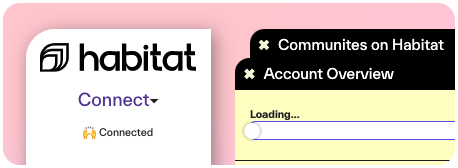
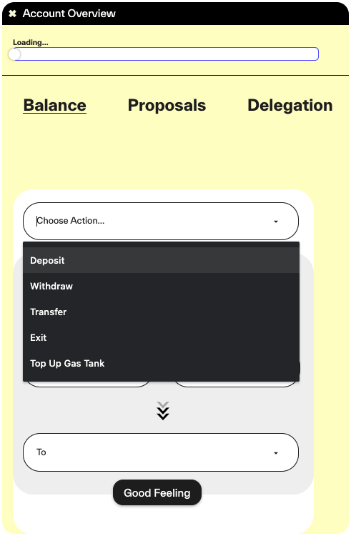

# Habitat Rollup 🌈

## **Mainnet App**
https://0xhabitat.org/app/

#### **Connect**
When opening the Habitat Rollup App, users can interact when clicking the "Connect" button in the top left sidebar.

#### **Account**
https://0xhabitat.org/app/#habitat-account

#### **Interactions**
Check the Tab "Balance" and open the dropdown menu, which gives plenty of options to choose from:

When interacting for the first time, please follow this flow:
1. [Deposit HBT](Deposit.md) - last time using ETH funds :)
2. [Top-Up Gas Tank](GasTank.md) ≈ 1-5 HBT is enough to start.
3. other options, unlocking after top-up:
  * deposit ERC20
  * transfer
  * vote/delegate
  * create communities/treasuries
  * withdraw/exit
