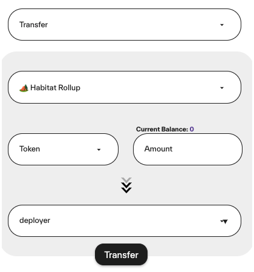

# Transfer 📡

When Users choose the option "Transfer", they cans end funds across the rollup to other users, communities or vaults.

1. Choose "Transfer" in dropdown menu
2. Select the token you want to transfer
3. Enter the address or username in the input field "To"

