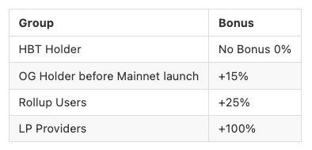

# Token Basics

## Multi-Sig Incident

On 1st of December 2021 the Team Multi-Sig was drained by an outside attacker. As a result the liquidity on Uniswap and Sushiswap was removed by the attacker and the project and all token-holders suffered a loss. Read all details about the incident [here](https://0xhabitat.substack.com/p/exploit2).

A new token is needed to leave **$HBT** behind and continue looking forward. We want to learn from the setup we had and prevent such attack vectors altogether.

## Relaunch

A new token to govern the community and the Habitat DAO will be released in the beginning of 2022. The distribution and token economics have been outlined in one of the latest blog posts. Read the full post about the $HABITAT token [here](https://0xhabitat.substack.com/p/endofyear).

## Tokenholder Snapshot 

As discussed in the Habitat social channels the Habitat team has taken a snapshot right before the multi-sig incident.

**[Snapshot Block - Etherscan](https://etherscan.io/block/13721615)**

👀🔎**Search for your address and final balance on the spreadsheet: [Excel Table - read-only Link](https://docs.google.com/spreadsheets/d/e/2PACX-1vRuiEDeHK7J8mb7iUoxrWxcjAxNJJE5CPUr4em0-3Y29zeioxRIBAH-u9dEDGQrZ_-R5Ij1VjdrD0sy/pubhtml)**

All token holders will get to claim their fair share of tokens in the upcoming token relaunch. All shareholders will be taking into consideration (liquidity providers, long-term holders, rollup users, HBT holders)

Some shareholder groups will get a bonus for using the app, by providing liquidity or by being a community member before the Mainnet launch. If you fall into multiple groups multiple bonuses are applied:

**Thank you for your patience, we are looking forward to this next chapter with our upcoming MVP launch of Habitat v2.**
